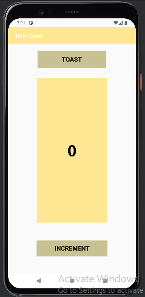
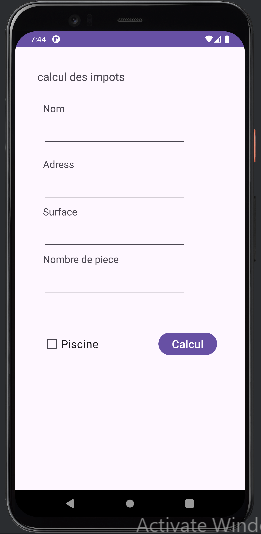

<!DOCTYPE html>
<html lang="fr">
<head>
    <meta charset="UTF-8">
    <meta name="viewport" content="width=device-width, initial-scale=1.0">
    <title>Exercice Android Studio</title>
</head>
<body>
    <h1>Calcul des Impôts Locaux</h1>
    

        Dans cet exercice Android Studio, j'ai développé une application permettant de calculer l'impôt local en fonction de la surface d'un bien, du nombre de pièces, et de la présence ou non d'une piscine. L'utilisateur saisit la surface et le nombre de pièces,autre information aussi et peut cocher une case si une piscine est présente. Un bouton Calcul affiche le calcul de l'impôt, qui se compose d'une taxe de base dépendant de la surface et d'une taxe supplémentaire en fonction du nombre de pièces et de la piscine. Les résultats sont ensuite affichés en bas de l'ecran.
    

    
    <h2>Images</h2>
    
    

    <h2>Vidéo</h2>
    <video controls width="500">
        <source src="https://github.com/user-attachments/assets/3a3c5d4d-9ab7-4b08-b51a-0f21e566fa1c" type="video/mp4">
        Votre navigateur ne supporte pas la balise vidéo.
    </video>
</body>
</html>
