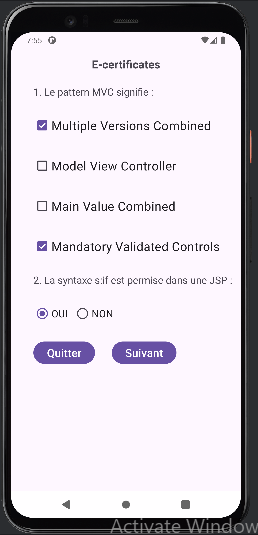
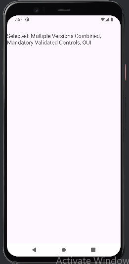

<!DOCTYPE html>
<html lang="fr">
<head>
    <meta charset="UTF-8">
    <meta name="viewport" content="width=device-width, initial-scale=1.0">
    <title>Exercice Android Studio</title>
</head>
<body>
    <h1>Calcul des Impôts Locaux</h1>
    

      Dans cet exercice, nous avons développé une application Android pour créer une interface utilisateur. L'application propose un questionnaire simple avec des options à choix multiples et des boutons radio. Les utilisateurs peuvent sélectionner plusieurs réponses a partir des cases à cocher et faire un choix entre OUI-NON à l'aide des boutons radio. les utilisateurs peuvent cliquer sur le bouton Suivant pour afficher le resultat.
    

    
    <h2>Images</h2>
    
    

    <h2>Vidéo</h2>
    <video controls width="500">
        <source src="https://github.com/user-attachments/assets/925078c1-f187-4636-adf9-fbdb5979bed7" type="video/mp4">
        Votre navigateur ne supporte pas la balise vidéo.
    </video>
</body>
</html>
