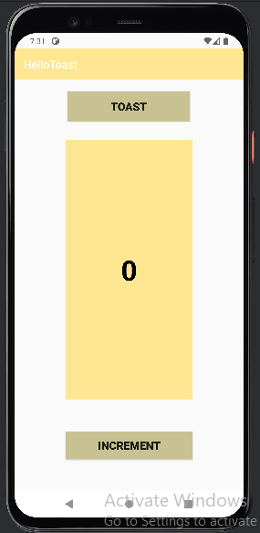
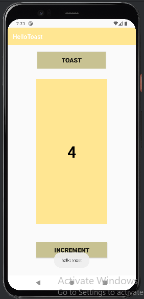

<!DOCTYPE html>
<html lang="fr">
<head>
    <meta charset="UTF-8">
    <meta name="viewport" content="width=device-width, initial-scale=1.0">
    <title>Exercice Android Studio avec ConstraintLayout</title>
</head>
<body>
    <h1>Exercice Android Studio - Application avec LinearLayout</h1>
    
Dans cet exercice, j'ai utiliser la methode LineartLayout. L'application comporte un TextView pour afficher un score, et deux boutons le premier pour incrémenter le score et le desieme bouton pour afficher un message Toast. La mise en page est réalisée à l'aide de LinearLayout.

    <h2>Images</h2>
    
    

    <h2>Vidéo</h2>
    <video width="500" controls>
        <source src="https://github.com/user-attachments/assets/01da4fd1-f369-4a9d-8c5f-7554ae1c984d" type="video/mp4">
        Votre navigateur ne supporte pas la balise vidéo.
    </video>
</body>
</html>
