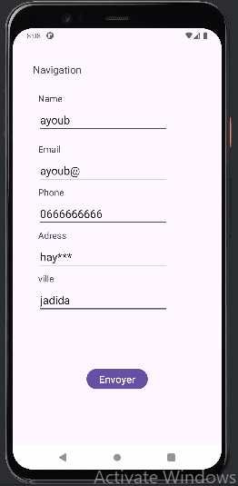
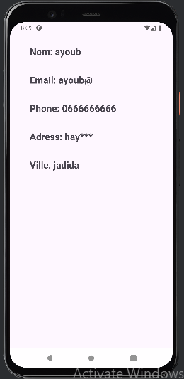

<!DOCTYPE html>
<html lang="fr">
<head>
    <meta charset="UTF-8">
    <meta name="viewport" content="width=device-width, initial-scale=1.0">
    <title>Application Android</title>
</head>
<body>
    <h1>Développement d'une Application Android</h1>
    

        L'application Android développée permet aux utilisateurs de soumettre des informations personnelles à travers une interface conviviale. 
        L'écran principal (MainActivity) comprend des champs pour saisir le nom, l'adresse, l'e-mail, la ville et le numéro de téléphone, ainsi qu'un bouton pour envoyer ces informations. 
        Lorsqu'un utilisateur remplit les champs et appuie sur le bouton "Envoyer", les données sont transférées à une seconde activité (MainActivity2) où elles sont affichées. 
        Aussi un autre bouton Quitter ,lorceque l'utilisateur clique sur ce button l'application ce ferme
    

    
    <h2>Images de l'application</h2>
    
    

    <h2>Vidéo de démonstration</h2>
    <video width="600" controls>
        <source src="https://github.com/user-attachments/assets/a2f60eb7-2b0e-49e2-b7da-4969b7fdf7d6" type="video/mp4">
        Votre navigateur ne supporte pas la vidéo.
    </video>
</body>
</html>
